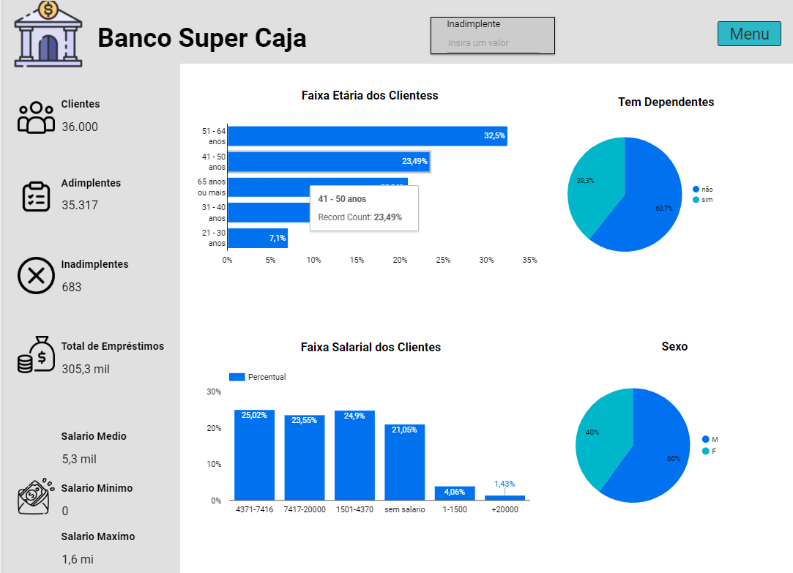

# 🏦Análise de Risco de Crédito no Banco Super Caja 🏦

### **Tabela de conteudos**   
  - [**Introdução**](#introdução)
  - [**Objetivo**](#objetivo)
  - [**Equipe**](#equipe)
  - [**Ficha Técnica**](#ficha-tecnica)
  - [**Fontes de dados**](#fonte-de-dados)
  - [**Tabelas utilizadas na análise**](#tabelas-utilizadas-na-análise)
  - [**Ferramentas e Tecnologias**](#ferramentas-e-tecnologias)
  - [**Processamento e análises**](#rocessamento-e-análises)
  - [**Resultados e Conclusões**](#Resultados-e-Conclusões) 
  - [**Google Sheets Dashboard**](#google-sheets-dashboard)
  - [**Referências**](#referências)
   

---

##  **📖 Introdução**

No atual cenário financeiro, a diminuição das taxas de juros tem gerado um notável aumento na demanda por crédito no banco "Super Caja". No entanto, essa crescente demanda tem sobrecarregado a equipe de análise de crédito, que atualmente está imersa em um processo manual ineficiente e demorado para avaliar as inúmeras solicitações de empréstimo. Diante desse desafio, propõe-se uma solução inovadora: a automatização do processo de análise por meio de técnicas avançadas de análise de dados.

---

## 🎯 **Objetivo**

O objetivo da análise é **identificar o perfil de clientes com risco de inadimplência**, montar uma pontuação de crédito a través da análise de dados e avaliar o risco relativo, possibilitando assim, classificar os clientes e futuros clientes em diferentes categorias de risco com base na sua probabilidade de inadimplência. Esta classificação permitirá ao banco tomar decisões informadas sobre a quem conceder crédito, reduzindo assim o risco de empréstimos não reembolsáveis. Além disso, a integração destas métricas fortalecerá a capacidade do modelo de identificar riscos, contribuindo para a solidez financeira e a eficiência operacional do Banco.

Esse objetivo é alcançado por meio dos seguintes subobjetivos:

- Identificar o perfil de clientes com risco de inadimplência
- Montar uma pontuação de crédito a través da análise de dados e avaliar o risco relativo, possibilitando assim, classificar os clientes e futuros clientes em diferentes categorias de risco com base na sua probabilidade de inadimplência
- Tomar decisões informadas sobre a quem conceder crédito, reduzindo assim o risco de empréstimos não reembolsáveis.
- Criar um modelo para identificar riscos, contribuindo para a solidez financeira e a eficiência operacional do Banco.

---

## 🤝 **Equipe**

 - Marianela Ruiz.
---

## 📰 **Ficha Técnica**

 - https://scratch-bean-ca0.notion.site/P3-Risco-Relativo-Ficha-T-cnica-d35d1bc2a636430aaac0dbe189b6a4ed
---

## 🔧 **Ferramentas e Tecnologias** 
- Ferramentas: BigQuery, Google Colab.
- Linguagens: SQL e Python.
- Ferramentas de visualização : Power BI.

---

## 📈 **Fontes de dados**
- Principal fonte de dados: https://drive.google.com/drive/u/0/folders/1AoQtdi6RHKqSdiy8E-pwExh8GXbJIVeE
- Manipulação de dados e Regressão logística em Python(Google Colab): https://colab.research.google.com/drive/1L53FX-L6vwMkOKRnWc7B6R8BKBYE2507#scrollTo=C0U3jEBL1utA
- Link ao relatório: https://lookerstudio.google.com/reporting/8933e74d-4411-42a4-9584-bad1e9d1fa5e

---

## 💻 **Tabelas utilizadas na análise**
- user_info: dados gerais dos clientes

- loans_outstanding: dados referente ao tipo de empréstimos e quantidade

- loans_detail: dados sobre o número de atrasos de pagamento de empréstimos, uso de linhas de crédito e relação ao seu limit e taxa de endividamento

- default: dados dos clientes inadimplentes e adimplentes

---

## 🔎 **Processamento e análises**
Várias etapas foram seguidas para preparar os dados para análise:

- Manipulação e limpeza dos dados: Utilizando o processo de ETL (Extract, Transform, Load) no BigQuery, realizei a limpeza e manipulação dos dados. Removi valores nulos, duplicados e inconsistências, além de calcular os quartis. Criei tabelas auxiliares, transformei os dados, e segmentei os clientes com base no risco relativo. As variáveis foram convertidas em dummies para a construção da matriz de confusão e para a realização de regressão logística.

- Visualização Interativa da Análise: Utilizamos o Looker Studio para criar gráficos e tabelas interativas que facilitam a visualização e compreensão da análise realizada.

- Modelo de Score de Crédito: foi realizada uma avaliação do modelo utilizando a matriz de confusão para análise de desempenho.

- Regressão Logística: Foi realizada uma análise preditiva do risco de inadimplência utilizando regressão logística, uma técnica robusta amplamente reconhecida por sua capacidade de modelar e prever comportamentos de risco com base em variáveis significativas.

---

## 💡 **Resultados e Conclusões**
A partir da análise realizada neste projeto, usando análise exploratória, modelo de classificação e regressão logística, analisei as características das músicas mais ouvidas no Spotify durante o ano de 2023. Uma série de hipóteses propostas pela gravadora foi validada para identificar as tendências que contribuem para o sucesso de uma música, com o objetivo de lançar um novo artista de acordo com as características do mercado.

## Hipótese 1: Os mais jovens correm um risco maior de Inadimplência:

- Clientes mais jovens (21 a 29 anos) e também aqueles entre 30 e 39 anos apresentam maior risco de inadimplência.
- Possíveis causas incluem o início de carreira, instabilidade financeira e falta de experiência em gestão financeira.

A hipótese foi **confirmada** e as recomendações são:

💡 Recomendações para esses clientes:

- **Mitigação de Riscos:** Implementar políticas para reduzir riscos entre clientes mais jovens, como limites de crédito mais baixos e processos de avaliação mais rigorosos.
- **Produtos Personalizados:** Desenvolver produtos financeiros específicos com condições mais adequadas para essa faixa etária.
- **Reestruturação de Dívidas:** Oferecer planos de renegociação de dívidas para clientes jovens inadimplentes.
- **Incentivos para Pagamento em Dia:** Oferecer benefícios para clientes jovens que mantêm pagamentos em dia.

## Hipótese 2: Clientes com mais empréstimos ativos têm um maior risco:

- Clientes com mais de 9 empréstimos apresentam um risco menor de inadimplência, o que contraria a hipótese inicial de maior risco com mais empréstimos.
- Possíveis causas incluem uma boa gestão financeira que permite o pagamento dos empréstimos.

A hipótese foi **refutada** e as recomendações são:

💡 Recomendações para esses clientes:

- **Análise de Crédito Mais Flexível:** Reavaliar critérios de crédito para clientes com múltiplos empréstimos.
- **Monitoramento e Suporte:** Fornecer suporte financeiro proativo para clientes com menos empréstimos.

## Hipótese 3: Clientes com mais de 90 dias de atraso têm maior risco:

- Atrasos superiores a 90 dias são fortes indicadores de inadimplência futura.
- Possíveis causas incluem dificuldades financeiras e problemas de gestão financeira que indicam maior probabilidade de inadimplência.

A hipótese foi **confirmada** e as recomendações são:

💡 Recomendações para esses clientes:

- **Programas de Recuperação de Crédito:** Criar programas para renegociação e recuperação para clientes com atrasos superiores a 90 dias.
- **Segmentação e Ofertas Personalizadas:** Desenvolver produtos financeiros específicos e oferecer suporte adicional para clientes nessa situação.
- **Monitoramento e Controle:** Implementar um sistema de alerta para monitorar atrasos de pagamento e oferecer intervenções preventivas.

<!-- 💡 **Recomendações** 💡 -->

---
<!-- ## **Limitações/Próximos Passos** -->

---

## 📊 **Painel de controle (dashboard) no Looker Studio**
https://lookerstudio.google.com/reporting/8933e74d-4411-42a4-9584-bad1e9d1fa5e

---

## **Referências**
- https://www.scielo.br/j/rsocp/a/RWjPthhKDYbFQYydbDr3MgH/?lang=pt
- https://www.blog.psicometriaonline.com.br/o-que-e-multicolinearidade/?ltk_gcm=17931339741&ltk_gag=138457321421&ltk_gac=623286237355&ltk_gne=g&gad_source=1&gclid=Cj0KCQjwsaqzBhDdARIsAK2gqnca8bca6xuEVw_03ek0m2b28jQ5IMGwU2tqEQ7079Fa7vHc-69XgXYaAkGNEALw_wcB
- https://med.estrategia.com/portal/conteudos-gratis/resumo-de-medidas-de-associacao-risco-relativo-razao-de-prevalencia-e-mais/
- https://bdm.unb.br/bitstream/10483/14087/1/2015_DianaOberdaCarneiroMarques.pdf
- https://www.teses.usp.br/teses/disponiveis/45/45133/tde-28122004-224257/publico/diss1GP.pdf

